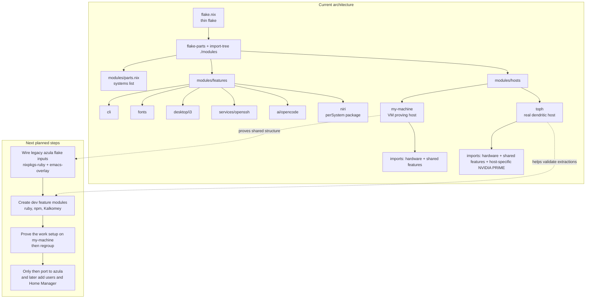

# Azula Dendritic Migration Plan

This document records the decisions we made for migrating the legacy config in `~/nixos-flakes` into the current working directory `~/myNixOS`.

The immediate focus is **a VM-first migration path for `azula` using `my-machine` as the proving host**.
`toph` has now been added as a real dendritic host, but the main migration target remains `azula`.

## Goal

Preserve the features currently available in `~/nixos-flakes/azula`, but reorganize the repo to follow the same style already used in `~/myNixOS`:

- thin `flake.nix`
- module discovery through `import-tree`
- flake composition through `flake-parts`
- host modules under `modules/hosts/`
- feature modules under `modules/features/`
- user modules under `modules/users/`

This is a structural migration first, not a rewrite for its own sake.

Active workspace:

- `~/myNixOS` is the new configuration repo we are building
- `~/nixos-flakes` is the legacy source we are migrating from

## Session Workflow

This session is being treated as a tutorial.

Working agreement:

- the user writes the code
- the assistant explains the next step explicitly
- the assistant maintains this plan file as the source of truth
- each step should be small enough to verify before moving on
- make one reviewable change at a time before starting the next one
- use subagents for low-value, high-effort work when they are the best fit for the task

Current execution rule:

1. explain the next change
2. make the smallest useful edit
3. verify that the result still evaluates or builds when practical
4. update this plan with what changed and what comes next

## Current Status

Current phase:

- Phase 1: Prove The Full Work Setup In `my-machine`

Current checkpoint:

- the VM remains the safety gate for all work-critical migration work
- the legacy `# Kalkomey` section is the work and development baseline to preserve
- `azula` must not be touched until the VM is good enough for the real work setup

Current next action:

- keep the existing thin `~/myNixOS/flake.nix`
- continue porting legacy `azula` workstation parity into reusable feature modules
- preserve the legacy flake-level behavior for `ruby-packages`, `pkgs-master`, filtered tree-sitter grammars, and `emacs-with-grammars`
- keep extracting concrete user and workstation boundaries so host files stop owning shared logic directly
- regroup only after the VM can carry the work setup safely

Current review queue for `my-machine`:

1. wire the legacy flake inputs into the current top-level flake without expanding the root structure
2. copy the legacy Ruby and npm behavior into new feature modules with minimal refactoring
3. isolate the `# Kalkomey` packages into a small dev feature module
4. import those modules into `my-machine` and verify evaluation or rebuild behavior there
5. regroup before creating `modules/hosts/azula/` or implementing the isolated work user

Full parity backlog for the VM-first pass:

- work/dev foundation
  - `modules/features/dev/kalkomey.nix`
  - `modules/features/dev/npm.nix`
  - `modules/features/virtualisation/docker.nix`
  - `ke` launchers under `/home/fedex/bin/ke`
  - `ke` work root `~/code/kalkomey` without declarative repo creation
- broad workstation packages
  - desktop, terminal, browser, media, dev, and work packages from legacy `azula`
  - keep hardware-tied packages out of the VM pass for now
- VM-safe services/configuration
  - minimal service parity first
  - keep self-hosting and GPU-specific services deferred until the real `azula` host exists

Current verified progress:

- the shared `i3` desktop session settings were extracted into `modules/features/desktop/i3.nix`
- `sudo nixos-rebuild switch --flake .#myMachine` succeeded after that extraction
- the VM shared folder mount for `azula` was added in `modules/hosts/my-machine/hardware.nix`
- shared OpenSSH and PipeWire modules were extracted successfully
- `pkgs-master` is already passed into `myMachine`
- `toph` already matches the currently proven shared workstation shape closely enough that no immediate `toph` work is required
- `azula` remains the migration target, but it should only be touched after the VM can safely carry the work setup
- `azula` currently needs the `fedex`, `ke`, and `jarvis` users
- the concrete Kalkomey workspace for `ke` is `/home/ke/code/kalkomey`, migrated from the current `~/code/kalkomey` tree
- `ke` is the work-isolated user boundary for `kelp` and `newt`, replacing the more generic `opencode-work` idea from `~/ai/opencode-buckets`
- `kelp` currently needs Ruby `3.4.9`, Node `22.14.0`, `yarn`, and legacy `bower`
- `newt` currently needs Ruby `2.7.6`, Node `10.4.0`, and legacy `bower`
- the first `ke` extraction should create the user module boundary first; the full Kalkomey toolchain should follow as a separate step
- `ke` now has the first Kalkomey user package slice on `my-machine`: `awscli2`, `nodejs_22`, `nomad`, `openvpn`, `vault`, `yarn`, and a local wrapper for legacy `bower@1.8.14`
- `nomad` can exceed the VM's practical build resources during `checkPhase`; rebuilding with `sudo nixos-rebuild switch --flake .#myMachine --cores 1 --max-jobs 1` succeeded
- `my-machine` now has dedicated feature modules for `kalkomey`, `npm`, `docker`, `libvirt`, and a broader workstation package/config layer
- `fedex` and `ke` now both have Docker group membership, and `fedex` also has `libvirtd`
- the host config now treats wheel sudo as passwordless, matching the intended VM access model
- local flake evaluation still succeeds after the new modules were added
- the remaining blocker for VM rebuild verification is that the current VM still prompts for sudo password over SSH until the VM-side sudo policy is updated or the first rebuild is run with elevated access
- the workstation layer now also carries the legacy 1Password unfree predicate and a few missing dev packages (`git-lfs`, `rustc`, `python3Packages.weasyprint`)
- the `ke` workflow is now smoke-tested on the VM: the launchers are present, the workdir was created manually at `/home/ke/code/kalkomey`, and the base tools resolve for the `ke` user
- the VM host now also matches several reference `azula` details that were still drifting: exact `fedex` UID/GID and description, passwordless wheel sudo, IP forwarding, the systemd generator workaround, autologin, and the `xrandr` primary-display session command

Current visual map:



Current baseline artifact:

- `~/myNixOS/docs/azula-current-behavior.md`

## Decisions Already Made

### 1. Target pattern

We will follow the pattern already present in `~/myNixOS`, not just a generic dendritic layout.

That means:

- a very small top-level `flake.nix`
- `flake-parts`
- `import-tree`
- exported flake modules from files under `modules/`

### 2. Scope

The current migration target is `azula`, but the structural migration should be proven in `~/myNixOS` on a dedicated VM host first.

We are intentionally deferring:

- any additional future machines after `toph`
- broader cleanup that is not required for `azula`

That means the practical scope is:

- build the dendritic layout
- stand it up first on a VM host
- use that VM host to validate the shared structure
- keep `toph` as a second real host that helps prove shared feature extractions
- then add `azula` on the same base with its real hardware, NVIDIA, filesystems, and host-specific details

### 3. User model

We want per-user configuration boundaries, not just account creation.

That means the long-term model should support:

- system account creation for each user
- per-user packages
- per-user shell/editor/git/session preferences
- per-user desktop configuration

Examples:

- `fedex` uses `i3`
- `ke` is the isolated Kalkomey work user that owns `/home/ke/code/kalkomey`
- other users may not use `i3`
- a machine should import only the users it needs

### 4. Home Manager

Home Manager is recommended for this repo.

Reason:

- it gives each user a clean place for personal configuration
- it scales well when the same user exists on multiple machines
- it avoids overloading host files with user-specific session details

But we do **not** want to introduce it in the very first migration step if doing so makes debugging harder.

Recommended approach:

1. migrate `azula` into the dendritic structure first
2. keep the system bootable in the new structure
3. add Home Manager once the structural migration is stable

### 5. Naming convention

For now, reusable modules should use simple descriptive names.

Examples:

- `flake.nixosModules.fonts`
- `flake.nixosModules.cli`
- `flake.nixosModules.i3`

Do not add a personal prefix to reusable modules.

Use the `fdx` prefix only when we later create custom personal package outputs that need to be distinguished from upstream packages.

Examples of future custom output names:

- `packages.fdxEmacs`
- `packages.fdxGhostty`
- `packages.fdxNiri`

## Recommended Boundaries

Use these boundaries consistently.

### Hosts

`modules/hosts/<host>/...`

Host modules answer:

- what machine is this?
- what hardware does it have?
- what bootloader/disk/GPU/display specifics does it require?
- which users and features are enabled on this machine?

Examples of host-level concerns for `azula`:

- hardware scan import
- boot loader
- hostname
- NVIDIA-specific settings
- machine-specific X11 monitor layout
- filesystems
- host-specific service decisions

### Features

`modules/features/...`

Feature modules answer:

- what capability do we want available?
- can this capability be reused by another host later?

Examples likely to become features:

- `ruby`
- `npm`
- `printing`
- `pipewire`
- `fonts`
- `desktop/i3`
- `desktop/x11`
- `services/openssh`
- `services/ollama`
- `virtualisation/docker`

Not every extraction needs to happen on day one.
We should only extract what is clear and helpful during the migration.

### Users

`modules/users/<name>/...`

User modules answer:

- who is this user?
- what should exist for them on this machine?
- what personal configuration belongs to them?

Long-term examples:

- `modules/users/fedex/default.nix`
- `modules/users/chini/default.nix`
- `modules/users/sofi/default.nix`
- `modules/users/emma/default.nix`
- `modules/users/gimena/default.nix`
- `modules/users/jarvis/default.nix`

Each host should import only the users it actually needs.

## Recommended End State For This Repo

This is the target shape we are moving toward.

```text
myNixOS/
├── flake.nix
├── flake.lock
└── modules/
    ├── parts.nix
    ├── hosts/
    │   ├── my-machine/
    │   │   ├── default.nix
    │   │   ├── configuration.nix
    │   │   └── hardware.nix
    │   └── azula/
    │       ├── default.nix
    │       ├── configuration.nix
    │       └── hardware.nix
    ├── users/
    │   ├── fedex/
    │   │   └── default.nix
    │   ├── chini/
    │   │   └── default.nix
    │   ├── sofi/
    │   │   └── default.nix
    │   └── emma/
    │       └── default.nix
    └── features/
        ├── fonts.nix
        ├── pipewire.nix
        ├── printing.nix
        ├── ruby.nix
        ├── npm.nix
        ├── desktop/
        │   ├── i3.nix
        │   └── x11.nix
        ├── services/
        │   ├── ollama.nix
        │   └── openssh.nix
        └── virtualisation/
            └── docker.nix
```

This is a target, not a requirement for the first pass.

## Migration Strategy

We will migrate into `~/myNixOS` through a VM-first path and then bring `azula` onto the same structure.

The main principle is:

> Keep the config understandable and buildable at every stage.

We should avoid doing a full extraction of every concern in one step.

VM-first principle:

- first prove the dendritic flake shape and shared workstation configuration on the VM
- then add `azula` by reusing the same shared configuration and layering in only the real host-specific pieces

## Step List

These are the steps we should follow across sessions.

### Phase 1: Structural Migration On A VM Host First

#### Step 1. Capture the current `azula` behavior

Before moving files around, confirm what `azula` currently contains.

Checklist:

- current flake inputs
- current special arguments
- hardware import path
- packages
- services
- desktop stack
- user account settings
- Docker/rootless settings
- NVIDIA settings
- any machine-specific quirks

Why:

- this is our baseline
- it reduces the chance of silently losing behavior during refactor

Status:

- completed
- baseline recorded in `~/myNixOS/docs/azula-current-behavior.md`
- priorities added so we know what must be preserved first during the structural move

#### Step 2. Create a thin top-level `flake.nix`

Use the top-level flake structure in `~/myNixOS` as the root of the migration.

Expected result:

- `flake.nix` declares inputs
- `flake.nix` uses `flake-parts`
- `flake.nix` uses `import-tree ./modules`

Why:

- this is the foundation of the pattern we chose
- it makes later host and feature additions much easier

Status:

- already satisfied by the current `~/myNixOS/flake.nix`
- no change needed before the first base host iteration

#### Step 3. Create `modules/parts.nix`

Add the systems list, matching the style of `~/myNixOS` unless there is a concrete reason to differ.

Why:

- this keeps the flake composition consistent with the current working pattern

Status:

- already satisfied by the current `~/myNixOS/modules/parts.nix`
- revisit only if this migration needs additional systems later

#### Step 4. Create `modules/hosts/my-machine/`

Create the first dendritic host for the migration VM.

Expected files:

- `modules/hosts/my-machine/default.nix`
- `modules/hosts/my-machine/configuration.nix`
- `modules/hosts/my-machine/hardware.nix`

Why:

- this lets us validate the new flake layout without changing `azula`
- it gives us a safe host to debug flake structure, imports, and shared config boundaries

#### Step 5. Make the VM host build in the new structure

Keep the VM host simple.

Recommended contents:

- same overall flake pattern we want for `azula`
- same user model direction
- same reusable workstation features when safe
- VM-specific hardware and boot settings only
- no `azula`-specific NVIDIA, monitor layout, filesystems, or service assumptions unless intentionally shared

Why:

- we want to validate the structure first, not clone all of `azula` into the VM

Tutorial note for the current session:

- go slower than the full migration plan
- first prove a tiny usable base system on `my-machine`
- add `ghostty` and `emacs` before adding legacy `azula` flake inputs or custom package wiring
- defer Home Manager until after the first minimal host is working, unless we decide that early user-level config is necessary for learning clarity

Current progress on the tutorial path:

- `my-machine` successfully builds as the proving host
- `emacs` and `ghostty` were added through `environment.systemPackages`
- `programs.zsh.enable = true` was added successfully
- `users.users.fedex.shell = pkgs.zsh` was added successfully
- a small workstation CLI base was added: `curl`, `git`, `jq`, `ripgrep`, `tree`
- extra daily-driver CLI tools were added: `fd`, `bat`, `htop`
- `i3` was enabled and supporting packages were added for a more realistic desktop workflow
- temporary manual `i3` user config is acceptable while we validate the VM as a real workstation
- autologin into the `i3` session for user `fedex` is working on the VM
- the next tutorial priority is structure: move obvious concerns out of the host file
- `fonts` was successfully extracted into `modules/features/fonts.nix`
- rebuilding taught an important flake rule: new module files must be tracked by git to be visible to flake evaluation
- `cli` was successfully extracted into `modules/features/cli.nix`
- `my-machine` now imports `cli` instead of owning those base CLI packages directly
- `my-machine` was aligned with the newer shared `toph` workstation shape while keeping VM-specific boot and hardware settings
- shared alignment now includes `pkgs-master` specialArgs, `opencode`, LightDM + `i3`, and the extra `sofi` user
- old generations are intentionally being kept for now during active iteration
- this confirms the basic host-module path is working
- `azula` remains deferred until `my-machine` is useful enough for real work

### Phase 2: Bring `azula` Onto The Proven Structure

#### Step 6. Create `modules/hosts/azula/`

Move `azula` into the host module structure.

Expected files:

- `modules/hosts/azula/default.nix`
- `modules/hosts/azula/configuration.nix`
- `modules/hosts/azula/hardware.nix`

Why:

- this gives `azula` a clean host boundary
- it mirrors the pattern used in `~/myNixOS`

Current execution note:

- do not start this step until `my-machine` is carrying the work-critical setup safely
- once we do start this step, stop after the host skeleton and regroup

#### Step 7. Make `azula` build in the new structure before deeper extraction

Keep most of the current host config intact at first if needed.

Why:

- the first success criterion is not perfect modularity
- the first success criterion is a correct structural migration with preserved behavior

### Phase 3: Extract Clear Features From `azula`

Only after the VM host and `azula` are both stable in the new structure.

#### Step 8. Extract the obvious reusable modules

Good first candidates:

- `ruby`
- `npm`
- `printing`
- `pipewire`
- `fonts`

Possible later candidates:

- `desktop/x11`
- `desktop/i3`
- `services/ollama`
- `virtualisation/docker`
- `services/openssh`

Why:

- these are capabilities, not machine identity
- they are likely to be reused by `toph` or later hosts

#### Step 9. Leave truly machine-specific logic in the host

Examples that likely stay in `azula`:

- monitor layout
- exact NVIDIA tuning
- filesystem layout
- boot specifics

Why:

- those settings answer what is special about `azula`
- forcing them into generic feature modules too early would reduce clarity

### Phase 4: Introduce User Boundaries

#### Step 10. Create `modules/users/fedex/default.nix`, `modules/users/ke/default.nix`, and `modules/users/jarvis/default.nix`

Start with `fedex`, `ke`, and `jarvis`, because `azula` currently needs those users.

Initial responsibilities:

- account creation
- groups
- shell
- any clearly user-owned settings that are not yet in Home Manager

Why:

- this creates the boundary we want before adding more users
- it prepares the repo for `chini`, `sofi`, `emma`, and `gimena`
- it creates the user boundary needed for the future `azula` host to carry the desktop user, the isolated Kalkomey work user, and the AI assistant user

Future user note:

- keep the first `ke` module minimal while proving the VM path
- add the concrete Kalkomey toolchain after the VM work setup is concrete and stable enough to discuss it clearly
- when we pick up the deeper `ke` work, explicitly discuss which Docker access model it needs and which browsers belong there, including `firefox`, `brave`, `firefox-devedition`, and any other development browsers

#### Step 11. Have hosts import only the users they need

For now:

- the VM host imports `fedex` and `ke` as needed while proving the structure
- `azula` imports `fedex`, `ke`, and `jarvis`

Later examples:

- another host might import `fedex` and `sofi`
- another might import only `emma`

Why:

- it cleanly separates user identity from host identity

### Phase 5: Add Home Manager

Only after the dendritic structure is stable.

#### Step 12. Add the Home Manager input and wire it into the flake

Why:

- this gives us a proper home-level configuration boundary
- it keeps personal configuration out of host files

#### Step 13. Expand `modules/users/fedex/` to own personal configuration

Candidates to move there:

- shell configuration
- git configuration
- user packages
- i3 configuration
- rofi
- dunst
- terminal preferences

Why:

- `fedex` uses `i3`, while other users may not
- this is exactly the kind of divergence Home Manager handles well

#### Step 14. Add future users when needed

When `chini`, `sofi`, `emma`, or `gimena` are added, create their user modules and import them only on the machines that need them.

Why:

- it keeps the repo scalable across multiple machines and users

## Recommended Order Of Work For The Next Sessions

This is the practical sequence I recommend.

1. Add legacy `azula` flake inputs and package wiring to the current flake
2. Create `modules/features/dev/ruby.nix`
3. Create `modules/features/dev/npm.nix`
4. Create `modules/features/dev/kalkomey.nix`
5. Import and prove those pieces on `my-machine`
6. Extend the `ke` user with the concrete Kalkomey toolchain once the VM work setup is concrete enough
7. Extract the `/home/fedex/bin/ke` launcher directory into an explicit module or user-owned boundary instead of leaving it host-local in `my-machine`
8. Create `modules/hosts/azula/` only after the VM path is trusted
9. Port host-specific `azula` behavior only after that checkpoint
10. Finish the isolated `ke` work environment later, once the host skeleton is stable
11. Add Home Manager after the structural migration is stable

## What We Are Explicitly Avoiding

We are not trying to:

- migrate every host at once
- extract every possible feature in the first pass
- introduce clever abstractions early
- mix machine migration and user-environment migration more than necessary

## Decision Summary

Current recommendation:

1. Focus only on `azula`
2. Treat `# Kalkomey` as the work and development baseline to preserve
3. Use `my-machine` as the safety gate and prove the full work setup there before touching `azula`
4. Match the `~/myNixOS` flake pattern exactly where practical
5. Keep host, feature, and user boundaries separate
6. Keep expanding the isolated work user `ke` only when the VM-first structure is stable enough to verify it safely
7. Introduce Home Manager only after the structural migration is stable
